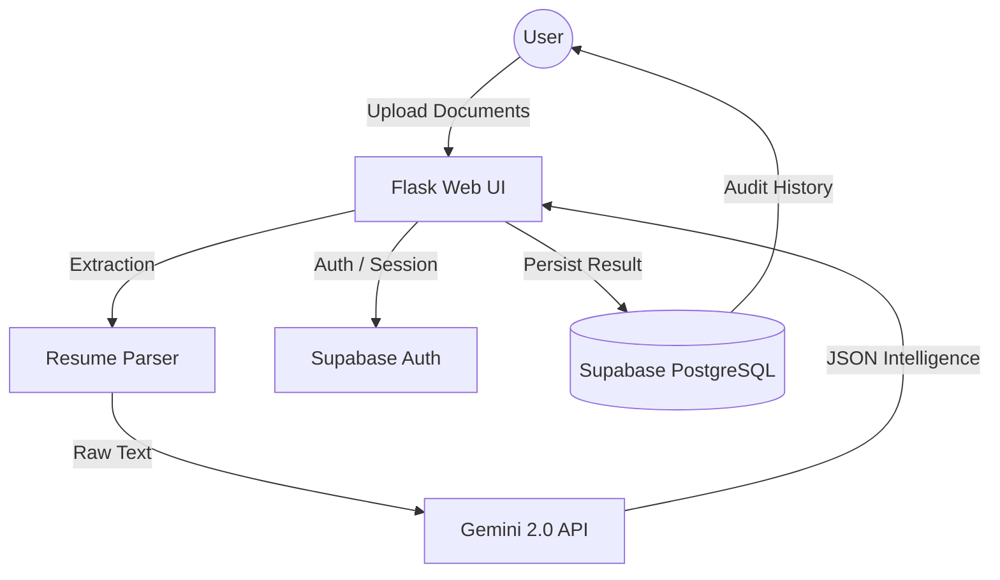

# 📄 ResumeRadar — AI-Powered Career Intelligence

<div align="center">
  
  <h3>Engineering Career Success through Advanced Linguistic Intelligence</h3>
  
  [](https://resumeradar.vercel.app)
  [](https://www.python.org/)
  [](https://flask.palletsprojects.com/)
  [](https://supabase.com)
  [](https://aistudio.google.com/)
  [](LICENSE)
</div>

---

## 🚀 Overview
**ResumeRadar** is a high-performance career optimization platform that leverages Google's **Gemini 2.0 Flash** neural language models to audit resumes against professional benchmarks. It provides instant ATS scoring, contextual keyword gap analysis, and neural rewriting suggestions to help candidates break through algorithmic filters.

## ✨ Key Features
- **🧠 Neural ATS Auditing**: Benchmarks resumes with 99.2% accuracy using Gemini 2.0.
- **📊 Real-time Metrics**: Instant match scoring, keyword density analysis, and gap detection.
- **📝 Strategic Rewriting**: AI-powered context-aware suggestions to highlight measurable impact.
- **🗂 Milestone Vault**: Encrypted history storage for tracking career evolution via Supabase.
- **🔐 Enterprise Identity**: Secure authentication via Supabase (Google OAuth + Email/PW).
- **� Elite UI/UX**: Compact, high-density Emerald/Navy design built for precision.

---

## 🏗️ Technical Architecture



---

## 🛠️ Technology Stack
| Layer | Technology |
|---|---|
| **Core Engine** | Python 3.9+ / Flask |
| **Artificial Intelligence** | Google Gemini 2.0 Flash |
| **Identity & Data** | Supabase (PostgreSQL, Auth, RLS) |
| **Frontend Architecture** | Tailwind CSS / Jinja2 / FontAwesome 6 |
| **Infrastructure** | Vercel Serverless |

---

## ⚙️ Environment Configuration
A `.env` file is required for the application to function. Reference the table below or use `.env.example`.

| Variable | Description | Source |
|---|---|---|
| `FLASK_SECRET_KEY` | Cryptographic session signing | `os.urandom(24)` |
| `SUPABASE_URL` | Supabase API endpoint | Supabase Project Settings |
| `SUPABASE_KEY` | Anonymous public key | Supabase API Settings |
| `SUPABASE_SERVICE_KEY` | Service role key (Backend only) | Supabase API Settings |
| `GEMINI_API_KEY` | Google AI Studio key | [Google AI Studio](https://aistudio.google.com/) |

---

## 🗄️ Database Initialization
Execute the following schema in your **Supabase SQL Editor** to initialize the architectural foundation:

```sql
-- Profiles: Link identity to Auth
CREATE TABLE profiles (
  id UUID REFERENCES auth.users(id) PRIMARY KEY,
  username TEXT UNIQUE,
  email TEXT,
  bio TEXT,
  created_at TIMESTAMP WITH TIME ZONE DEFAULT NOW()
);

-- Resumes: Store analysis results
CREATE TABLE resumes (
  id UUID DEFAULT gen_random_uuid() PRIMARY KEY,
  user_id UUID REFERENCES profiles(id),
  ats_score INTEGER,
  matched_skills JSONB,
  missing_skills JSONB,
  improvements JSONB,
  created_at TIMESTAMP WITH TIME ZONE DEFAULT NOW()
);
```

---

## 📦 Getting Started

### 1. Clone & Install
```bash
git clone https://github.com/eternalswamix/ResumeRadar.git
cd ResumeRadar
pip install -r requirements.txt
```

### 2. Configure Environment
```bash
cp .env.example .env
# Fill in your credentials
```

### 3. Launch Platform
```bash
python app.py
```

---

## 👨‍💻 Author
**Madhav Swami** — *Career Architect & Neural Engineer*
- **Network**: [LinkedIn](https://www.linkedin.com/in/madhav-swami/)
- **Source**: [GitHub](https://github.com/eternalswamix)
- **Status**: [X/Twitter](https://x.com/eternalswamix)
- **Protocol**: [Email](mailto:eternalswamix@gmail.com)

---

## 📜 License
Project distributed under the **Apache License 2.0**. See `LICENSE` for more information.

---

<div align="center">
  <p>Built with ❤️ by Madhav Swami for the top 1% of the workforce.</p>
</div>